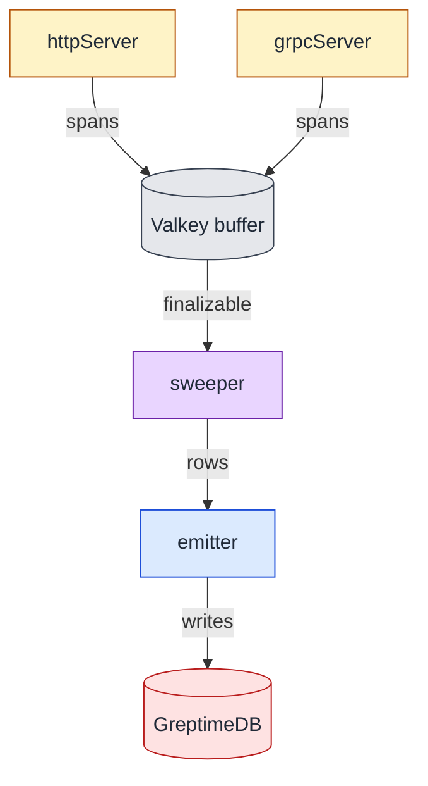

# Service lifecycle

This document is the contract for how tracealyzer's long-lived
components are started, run, and stopped. It captures the load-bearing
decisions in `internal/run/`, `cmd/mdai-tracealyzer/main.go`, and the
component implementations (`ingest`, `emit`, `sweep`) so future fixes
land in the right place and re-litigate as little as possible.

## Component contract

A component implements `internal/run/Component`:

```go
type Component interface {
    Name() string
    Start(ctx context.Context, host Host) error
    Shutdown(ctx context.Context) error
}
```

- **Start** launches the component's background work and returns
  promptly. The Start ctx scopes initial wiring (bind a listener,
  dial a client) and is not retained past Start's return. Background
  goroutines derive their own contexts from `context.Background`.
- **Shutdown** owns the component-specific stop mechanism
  (`context.CancelFunc`, `http.Server.Shutdown`,
  `grpc.Server.GracefulStop`, channel close + wait, etc.) and joins
  its background goroutines before returning. Shutdown is
  idempotent and safe to call without a prior Start.
- **Host.Fatal** is the escalation seam for failures detected after
  Start returns. It is non-blocking and shutdown-safe so a component
  can call it from inside a serve goroutine without coordinating with
  the supervisor's state.

## Supervisor responsibilities

`internal/run/Supervisor` orchestrates one run:

1. Calls `Start` on each component in registration order. Start
   returns promptly so sequential calls compose without parallelism.
2. Blocks on the first of: parent ctx cancel, or a `Host.Fatal`
   signal from any component.
3. Runs the `OnShutdown` hook (currently
   `ready.MarkShuttingDown` from `cmd/mdai-tracealyzer/main.go`).
4. Calls `Shutdown` on each component in *reverse* registration
   order under `WithTimeout(WithoutCancel(parent), grace)`. The
   `WithoutCancel` parent keeps request-scoped values while
   detaching the already-tripped parent cancellation. `grace`
   comes from `cfg.Service.ShutdownGrace`.
5. Drains any late `Host.Fatal` signals into the returned joined
   error.

`Supervisor.Run` is one-shot. A second call returns
`ErrRunAlreadyCalled`.

## Component ordering

Registration order encodes the dependency graph: sinks first, sources
last. Current order in `cmd/mdai-tracealyzer/main.go`:

```
admin, schemaProbe, emitter, emitterProbe, sweeper, grpcServer, httpServer
```

Reverse Shutdown therefore tears sources down first
(`httpServer`, `grpcServer`, `sweeper`) and sinks last
(`emitter`, `admin`). The invariant: a sink is never asked to
accept new work after the sources feeding it have closed, and a
source is never closed after a sink it feeds has already torn down.

The sweeper sits between sources and sinks. It is registered
*after* the emitter (so Shutdown runs the sweeper before the
emitter) because the sweeper produces rows the emitter must accept;
closing the emitter first would strand drained rows.



Start order (top-to-bottom in `cmd/mdai-tracealyzer/main.go`):

```
1. admin           ← serves /healthz, /metrics first so probes can see them
2. schemaProbe     ← marks readiness("schema") when Greptime SQL is up
3. emitter         ← background flush loop
4. emitterProbe    ← marks readiness("emitter") when emitter writer is up
5. sweeper         ← waits on readiness gate before its first tick
6. grpcServer      ← starts accepting OTLP traffic
7. httpServer      ← starts accepting OTLP traffic
```

Shutdown is the exact reverse: ingest stops accepting new traffic
first; admin stays up last so liveness/metrics remain scrapable
through the tear-down window.

## Background contexts and destructive work

Two contexts coexist inside a running component:

- The **supervisor parent ctx**, threaded into Start, is the
  "stay-running" signal. SIGTERM cancels it.
- The **component-internal ctx**, derived from `context.Background`
  inside the goroutine, is the "do not interrupt destructive work"
  context. Tied to a per-component `stopCh` instead of the parent
  cancel.

The split exists because some pipelines lose data if interrupted
mid-flight. The sweeper's `Drain` is the load-bearing example:
`HGETALL + DEL` runs atomically against Valkey, but a client-side
interruption between server-processed and client-received leaves an
ambiguous outcome (state gone server-side, error returned to
caller, rows never reach emitter).

`Sweeper.Shutdown` therefore joins on the sweep goroutine
unconditionally and does not honour the shutdown ctx. Drain is
called with `context.Background()` — neither `Shutdown` nor the
shutdown ctx cancels it. The shutdown ctx is the *budget* the
supervisor will wait, not a cancellation signal for the destructive
path.

Liveness for the destructive path is bounded at the I/O boundary by
the Valkey client's per-operation timeout
(`buffer.valkey_operation_timeout`), plumbed into
`valkey.ClientOption.ConnWriteTimeout`. A stalled or unresponsive
Valkey connection fails the in-flight Drain within that bound; the
sweeper then joins and Shutdown returns. `ShutdownGrace` must be
sized larger than the worst-case sweeper drain window,
approximately `valkey_operation_timeout + compute/emit overhead`
for one claimed trace per worker still in-flight when Shutdown
fires.

This is a bounded-shutdown/liveness fix, not a no-loss guarantee.
An ambiguous Drain — Valkey processed the `EXEC` server-side but
the client times out before reading the reply — still loses those
rows. The timeout caps how long shutdown waits; it does not
recover state that was destructively removed without a reply.

Non-destructive reads (sweep `Scan`, probe checks) take explicit
deadlines because a missed read costs at most a retry on the next
tick.

## Decisions already taken

The following alternatives were considered and rejected; future
changes should not re-introduce them without addressing the listed
counter-argument.

| Alternative | Why rejected |
|---|---|
| `Start` blocks for the component's lifetime (old pre-`vs/fixes` shape) | Post-Start failures had no escalation path. Replaced by Start-returns-then-Host.Fatal. |
| `Shutdown` honours ctx and abandons its goroutine on grace expiry | A surviving sweeper iteration can complete a destructive `Drain` and then call `Emit` on an already-closed emitter, returning `ErrClosed` and losing rows. Shutdown waits on its goroutine unconditionally. |
| Wrapping `Drain` or the whole sweep `tick` in `context.WithTimeout` | Interrupts the destructive pipeline mid-flight; risks partial Valkey state. Liveness is bounded by `buffer.valkey_operation_timeout` (passed to `valkey.ClientOption.ConnWriteTimeout`) instead. |
| Emitter's final flush gets an *additive* deadline via `WithoutCancel(ctx)` past the supervisor's grace | Violates the grace contract; will eventually trip Kubernetes SIGKILL mid-write. The proposed shape is a reserved-budget split *inside* the grace. |
| `Start` runs components in parallel via `errgroup` | Unnecessary once Start returns promptly; sequential calls give clean log ordering and let a Start error abort registration without cancelling earlier components' background work. |
| `Host.Fatal` blocks until the supervisor acknowledges | The supervisor may already be in shutdown; blocking would deadlock the serve goroutine. `Host.Fatal` is non-blocking with a fatal channel and an overflow list. |

## Invariants that must hold

These bind future changes:

- **Grace is the upper bound.** Total wall-clock time from supervisor
  signal-receive to `Supervisor.Run` return ≤
  `cfg.Service.ShutdownGrace`. Components that need longer than
  grace are bugs; their `Shutdown` must be bounded by client-level
  or in-component deadlines that fit inside grace. For the sweeper
  this bound is `buffer.valkey_operation_timeout` plus the
  compute/emit overhead for one in-flight trace per worker.
- **No destructive write returns success without an emit path.** A
  successful `Drain` (Valkey state removed) must reach the emitter
  queue before the emitter closes. The component ordering protects
  this on graceful shutdown; the sweeper-joins-on-Shutdown rule
  protects it on grace-expired shutdown.
- **Shutdown is idempotent and pre-Start-safe.** A `Shutdown` call
  without a prior `Start` is a no-op (or a listener-close); a
  second `Shutdown` call is a no-op via `sync.Once`.
- **The component registration list is the dependency graph.** Any
  new component is inserted at the position that satisfies "all my
  sinks are earlier in the list."

## Where to change what

- The `Component` contract: `internal/run/component.go`,
  `internal/run/host.go`. Changes here ripple to every component
  implementation.
- Supervisor behaviour: `internal/run/supervisor.go`. Test surface
  in `internal/run/supervisor_test.go`.
- Component registration order: `cmd/mdai-tracealyzer/main.go`
  (`serve` function). Changing order requires re-checking the
  invariant above.
- Per-component lifecycle (Start/Shutdown shape): the component's
  own package (`internal/ingest/`, `internal/emit/`,
  `internal/sweep/`, `internal/run/probe.go`, and `adminComponent`
  in `main.go`).

Related contract: `docs/ingest-response-policy.md` covers the
per-batch response-code decision, which interacts with this
lifecycle only at the edges (e.g. `Host.Fatal` from a serve loop
during shutdown).
